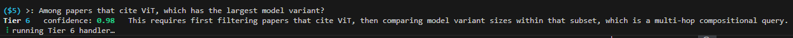
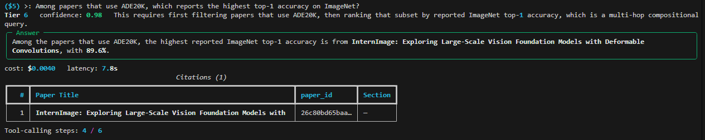
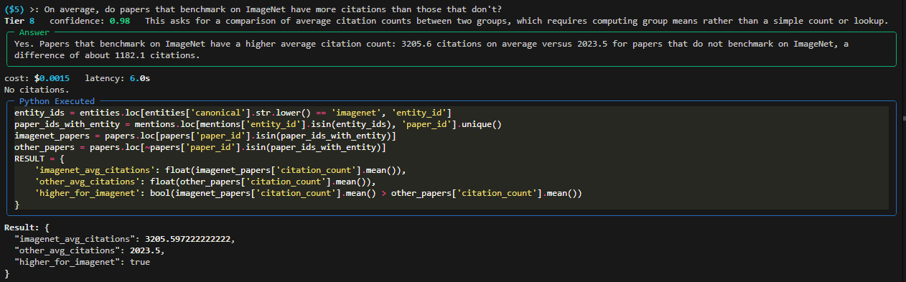

# Vision Transformer Research Comprehension System






Q&A system over the 100 most-cited Vision Transformer papers. Ask it anything about the corpus and it routes to the right handler, returns a cited answer, and shows its work.

**One-time prep cost:** ~$6.90 | **Per eval run (40 questions):** ~$0.07 | **Accuracy:** 90%+ across all budget levels

---

## Why I built this

Started as a take-home assessment, turned into a learning project around two things:

**Building real RAG, not an AI wrapper.** Most RAG tutorials embed a PDF and call it done. That doesn't work when questions span different reasoning modes. "How many papers use COCO?" needs a SQL count. "Which ViT-citing paper has the largest model?" needs a multi-step agent. A single retriever can't handle both well, so I built a tiered system where each question type gets the right tool.

**A niche version of NotebookLM.** I wanted to understand what it takes to make a domain-specific comprehension system that actually knows things like "mIoU" and "mean Intersection-over-Union" are the same entity, that there's a citation graph between papers, and that some questions need set arithmetic ("what's missing?") instead of retrieval. That specificity is the whole point.

---

## Try it

The quickest way is the interactive CLI:

```bash
source venv/Scripts/activate
python scripts/ask_cli.py
```

```
($5) > Which paper introduced shifted window attention?
($5) > How many papers benchmark on both ImageNet and COCO?
($5) > Among papers citing ViT, which has the largest model variant?
($5) > Which standard segmentation datasets are NOT covered in this corpus?
($5) > /budget $1      # switch budget level
($5) > /last           # dump full evidence JSON
($5) > /help           # all commands
```


Or via the API after `uvicorn main:app --reload`:

```bash
curl -X POST http://localhost:8000/ask \
  -H "Content-Type: application/json" \
  -d '{"question": "Which ViT variant has the best ImageNet top-1 accuracy?", "budget_level": "$5"}'
```

---

## What it can answer

Each question is routed to one of 8 handlers by a GPT classifier:

| Tier | Type | Example |
|------|------|---------|
| T1 | Single-paper factual | "What architecture does ViT use?" |
| T2 | Corpus aggregation | "How many papers benchmark on ImageNet?" |
| T3 | Contradiction / comparison | "Do papers agree on ADE20K SOTA?" |
| T4 | Temporal evolution | "How did top-1 accuracy change year over year?" |
| T5 | Citation graph | "Which paper is most cited within this corpus?" |
| T6 | Multi-hop compositional | "Among ViT-citing papers, which has the largest model?" |
| T7 | Negation / absence | "Which segmentation datasets are NOT used here?" |
| T8 | Quantitative compute | "What is the median parameter count across all models?" |

Every answer includes citations and the evidence behind it (SQL query, retrieved chunks, graph results, etc.).

---

## Setup

```bash
python -m venv venv
source venv/Scripts/activate   # Windows Git Bash
# source venv/bin/activate     # macOS / Linux
pip install -r requirements.txt
```

`.env` in project root:

```env
OPENAI_API_KEY=sk-...
DATALAB_API_KEY_1=...    # free-tier key for PDF parsing
DATALAB_API_KEY_2=...    # optional second key for failover
```

---

## Reproducing the pipeline

One-time prep, ~57 min, ~$6.90. Every step is idempotent.

```bash
python scripts/fetch_papers.py      # pull 100 papers from Semantic Scholar
python scripts/download_pdfs.py     # download PDFs (~2-3 min)
python scripts/parse_pdfs.py        # Datalab Marker cloud API (~30 min, ~$5.35)
python scripts/extract_papers.py    # GPT structured extraction (~19 min, ~$1.41)
python scripts/normalize_numbers.py # regex number normalization (<1s, free)
python scripts/normalize_entities.py # 6-stage entity canonicalization (~75s, ~$0.04)
python scripts/build_indexes.py     # SQLite + Chroma + NetworkX (~2.5 min, ~$0.05)
python scripts/sanity_check.py      # 33 end-to-end checks (~20s)
```

> Datalab's free tier covers ~55 papers per key. Two keys handle all 100. The script rotates automatically on rate limits.

---

## Budget levels

The `budget_level` field on `/ask` controls retrieval depth and agent step count:

| Level | Retrieval k | T6 max steps | Notes |
|-------|-------------|--------------|-------|
| `$1`  | 3  | 3  | Fast, still 100% on eval |
| `$5`  | 8  | 6  | Default |
| `$20` | 15 | 10 | More headroom for complex questions |

Run the eval suite:

```bash
python scripts/run_eval.py             # all 3 budget levels
python scripts/run_eval.py --budget '$5'
python scripts/run_eval.py --limit 5   # first 5 questions only
```

Results go to `eval/RESULTS.md` and `eval/reports/`.

---

## Repo layout

```
data/
  corpus.db               # SQLite: papers, entities, results, claims, mentions
  chroma/                 # vector store (3768 section-level chunks)
  citation_graph.gpickle  # NetworkX DiGraph (761 in-corpus edges)
  entity_map.json         # 1,950 canonical entities with aliases
  cost_log.jsonl          # append-only spend log

api/core/
  store.py        # SQLite + NetworkX wrapper
  retrieval.py    # Chroma search
  classifier.py   # tier router
  handlers/       # tier1.py ... tier8.py
  budget.py       # BUDGET_LEVEL config + spend tracking

scripts/
  ask_cli.py      # interactive REPL (start here)
  run_eval.py     # quality-vs-budget runner
  build_indexes.py
  ...

eval/
  questions.jsonl  # 40 gold questions
  RESULTS.md       # latest scores
```

---

See [ARCHITECTURE.md](ARCHITECTURE.md) for design decisions and [COST_REPORT.md](COST_REPORT.md) for the full cost and quality breakdown.
