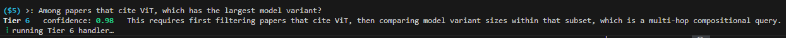
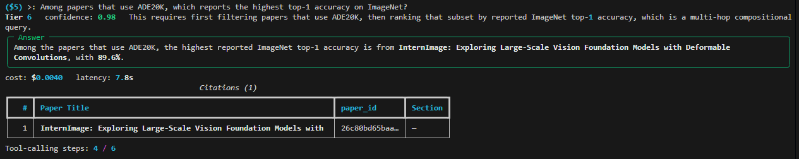
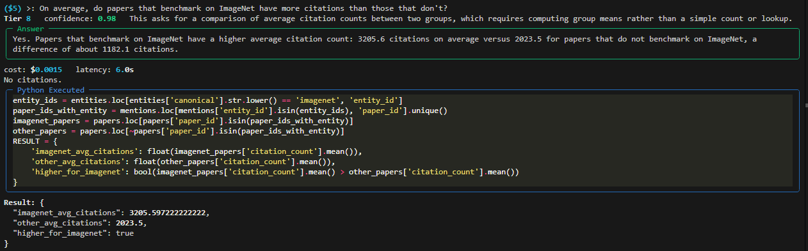

# Vision Transformer Research Comprehension System






Q&A system over the 100 most-cited Vision Transformer papers. Ask it anything about the corpus and it routes to the right handler, returns a cited answer, and shows its work.

**One-time prep cost:** ~$6.90 | **Per eval run (40 questions):** ~$0.07 | **Accuracy:** 90%+ across all budget levels

---

## Why I built this

**Building real RAG, not an AI wrapper.** Most RAG tutorials embed a PDF and call it done. That doesn't work when questions span different reasoning modes. "How many papers use COCO?" needs a SQL count. "Which ViT-citing paper has the largest model?" needs a multi-step agent. A single retriever can't handle both well, so I built a tiered system where each question type gets the right tool.

**A niche version of NotebookLM.** I wanted to understand what it takes to make a domain-specific comprehension system that actually knows things like "mIoU" and "mean Intersection-over-Union" are the same entity, that there's a citation graph between papers, and that some questions need set arithmetic ("what's missing?") instead of retrieval. That specificity is the whole point.

---

## Try it

The quickest way is the interactive CLI:

```bash
python -m venv venv
source venv/Scripts/activate   # Windows Git Bash
pip install -r requirements.txt

python scripts/ask_cli.py
```

Example CLI prompts:

```text
($5) > Which paper introduced shifted window attention?
($5) > How many papers benchmark on both ImageNet and COCO?
($5) > Among papers citing ViT, which has the largest model variant?
($5) > Which standard segmentation datasets are NOT covered in this corpus?
```

Run the API:

```bash
uvicorn main:app --reload
```

```bash
curl -X POST http://localhost:8000/ask \
  -H "Content-Type: application/json" \
  -d '{"question": "Which ViT variant has the best ImageNet top-1 accuracy?", "budget_level": "$5"}'
```

## Setup

Create `.env` in the project root:

```env
OPENAI_API_KEY=sk-...
DATALAB_API_KEY_1=...
DATALAB_API_KEY_2=...
S2_API_KEY=...          # optional, raises Semantic Scholar rate limit
```

## Rebuild The Corpus

The checked-in artifacts are kept so reviewers can demo the project quickly. The pipeline is still reproducible:

```bash
python scripts/fetch_papers.py
python scripts/download_pdfs.py
python scripts/parse_pdfs.py
python scripts/extract_papers.py
python scripts/normalize_numbers.py
python scripts/normalize_entities.py
python scripts/build_indexes.py
python scripts/sanity_check.py --skip-llm
```

## Evaluate

```bash
python scripts/run_eval.py --budget '$5' --limit 5
python scripts/run_eval.py
```

Reports are written to `eval/reports/`; the latest summarized results live in `eval/RESULTS.md`.

## Architecture

```text
api/routes/
  ask.py          HTTP request/response only
  eval.py         eval endpoint only
  papers.py       manifest browsing and corpus refresh endpoints

api/core/
  pipeline.py     shared classify -> handle -> response orchestration
  runtime.py      request-scoped budget config
  budget.py       budget profiles and cost logging
  sql_safety.py   read-only SQL validation
  store.py        SQLite + citation graph wrapper
  retrieval.py    Chroma retrieval wrapper
  classifier.py   tier router
  handlers/       one module per question tier

scripts/
  ask_cli.py      interactive CLI using the shared pipeline
  run_eval.py     quality-vs-budget eval runner
  build_indexes.py and ingestion/normalization scripts
```

## Artifact Policy

Kept in git for reviewer convenience:

- `data/manifest.csv`
- `data/corpus.db`
- `data/chroma/`
- `data/citation_graph.gpickle`
- `data/extractions/`, `data/normalized/`, `data/markdown/`
- `eval/questions.jsonl`, `eval/RESULTS.md`, selected `eval/reports/`

Ignored going forward:

- secrets and local envs
- Python caches
- transient cost/failure logs
- temporary eval outputs

## Quality And Cost

The latest recorded 40-question eval run reports 100% pass rate across `$1`, `$5`, and `$20` settings, with roughly `$0.07` per full eval run. See `COST_REPORT.md` for the cost breakdown.

## Verification

```bash
venv/Scripts/python.exe -m compileall -q main.py api scripts tests
venv/Scripts/python.exe -m unittest tests.test_review_polish
venv/Scripts/python.exe scripts/sanity_check.py --skip-llm
```
